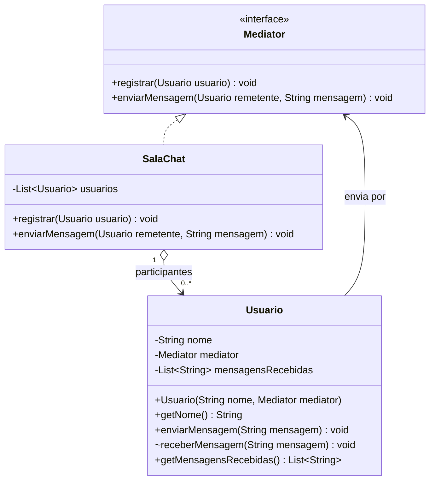

```mermaid
classDiagram
    class Mediator {
        <<interface>>
        +registrar(Usuario usuario) void
        +enviarMensagem(Usuario remetente, String mensagem) void
    }

    class SalaChat {
        -List~Usuario~ usuarios
        +registrar(Usuario usuario) void
        +enviarMensagem(Usuario remetente, String mensagem) void
    }

    class Usuario {
        -String nome
        -Mediator mediator
        -List~String~ mensagensRecebidas
        +Usuario(String nome, Mediator mediator)
        +getNome() String
        +enviarMensagem(String mensagem) void
        ~receberMensagem(String mensagem) void
        +getMensagensRecebidas() List~String~
    }

    Mediator <|.. SalaChat
    SalaChat "1" o--> "0..*" Usuario : participantes
    Usuario --> Mediator : envia por
```
